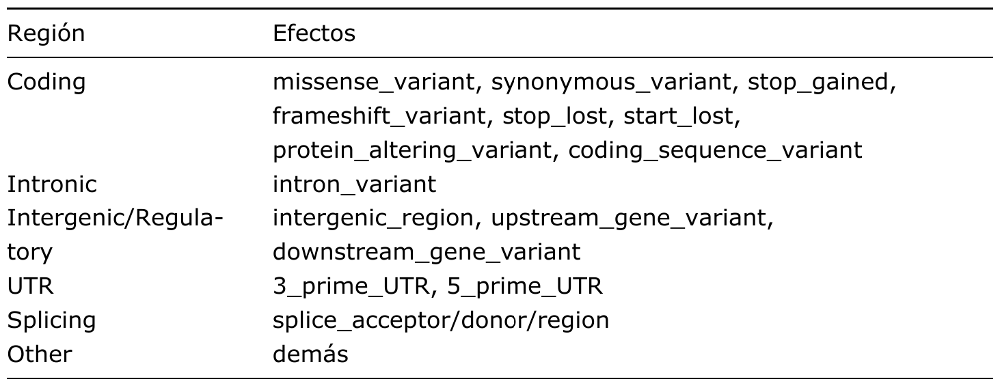
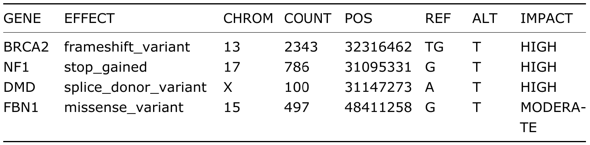
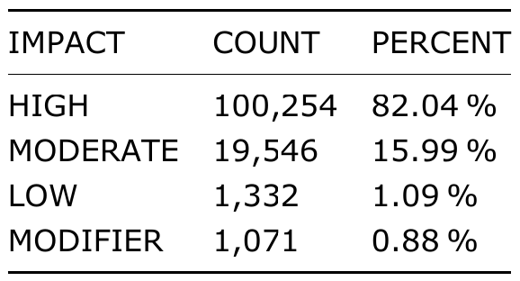
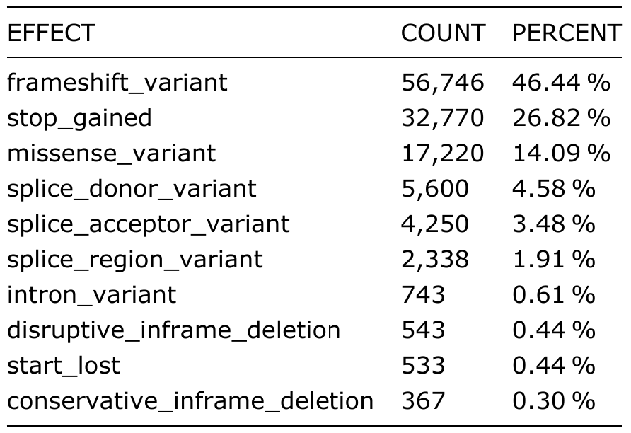

```{=latex}
\thispagestyle{fancy}

```{r Setup de Python}
#| echo: false
#| message: false
#| warning: false
#| include: false
library(reticulate)
use_condaenv("py-sci", required = TRUE)
py_config()
```

```{python Librerías de python}
import pandas as pd
```

```{r Librerías de R}
library(tidyverse)
library(cowplot)
```

# Introducción

Las **enfermedades mendelianas** son trastornos genéticos causados principalmente por variantes de alta penetrancia en genes individuales, cuya alteración puede modificar la estructura, estabilidad o actividad de la proteína codificada. Algunos efectos moleculares son la introducción de codones de paro prematuros, cambios en el marco de lectura (*frameshift*), alteraciones del *splicing* y sustituciones de aminoácidos, las cuales pueden contribuir al desarrollo de fenotipos patológicos mediante pérdida o alteración de la función génica [@nussbaum2023thompson]. 

Actualmente, existen bases de datos clínicas como [ClinVar](https://www.ncbi.nlm.nih.gov/clinvar/){.underline}, que permiten obtener tanto variantes humanas asociadas a enfermedades hereditarias, como información sobre su relevancia clínica y genes implicados. Asimismo, recursos como [OMIM](https://www.omim.org){.underline} posibilitan la identificación de enfermedades mendelianas y sus genes asociados.

El análisis bioinformático de variantes permite clasificarlas de acuerdo con su localización genómica y su posible efecto funcional. En este proyecto se utilizaron variantes patogénicas de ClinVar asociadas a enfermedades mendelianas mediante identificadores OMIM y se anotaron con [`SnpEff`](https://pcingola.github.io/SnpEff/){.underline}, una herramienta que predice efectos de variantes sobre genes, transcritos y proteínas [@cingolani-2012]. Con ello, se buscó determinar qué proporción de variantes se localiza en regiones codificantes, intrónicas e intergénicas/regulatorias, así como interpretar sus posibles consecuencias moleculares y fenotípicas.

# Objetivo

Identificar y anotar funcionalmente variantes patogénicas humanas asociadas a enfermedades mendelianas a partir de datos de ClinVar y OMIM, con el fin de caracterizar sus efectos y analizar su distribución genómica.

# Metodología

## Obtención y filtrado de variantes 

Se descargó de ClinVar el archivo [`clinvar.vcf.gz`](https://www.ncbi.nlm.nih.gov/clinvar/docs/downloads/) correspondiente al ensamblaje humano GRCh38 (último *release* oficial). A partir de este archivo se seleccionaron únicamente variantes clasificadas como `Pathogenic`, con el fin de trabajar con variantes con mayor evidencia clínica de asociación a enfermedad [@landrum-2013].

Posteriormente, se filtraron las variantes asociadas a enfermedades mendelianas mediante la presencia de identificadores `OMIM` en las anotaciones clínicas. El conjunto final estuvo compuesto por 122,211 variantes patogénicas asociadas a enfermedades mendelianas y fueron almacenadas en un archivo tabular y posteriormente en un VCF, formato compatible con las herramientas de anotación funcional a utilizar.

## Anotación y clasificación funcional de variantes

La anotación funcional se realizó con [`SnpEff`](https://pcingola.github.io/SnpEff/){.underline}. Las variantes fueron clasificadas según su impacto funcional en las categorías `HIGH`, `MODERATE`, `LOW` y `MODIFIER`, lo que permitió priorizar aquellas con mayor probabilidad de alterar la función proteica [@cingolani-2012].

Debido a que una misma variante puede afectar múltiples transcritos, el análisis se realizó considerando variantes únicas para evitar potenciales redundancias en el conteo de las mismas. De esta forma, las variantes fueron agrupadas en función de su posición genómica y alelos de referencia/alternativos (`CHROM`, `POS`, `REF`, `ALT`).

En aquellos casos con una misma variante asociada a distintas anotaciones funcionales, se conservó aquella correspondiente al mayor impacto funcional reportado por `SnpEff` *inter-categoría* (`HIGH` \> `MODERATE` \> `LOW` \> `MODIFIER`) y al efecto molecular más severo anotado *intra-categoría*, siguiendo el siguiente orden, de forma descendente: `stop_gained`, `frameshift_variant`, `splice_acceptor_variant`/`splice_donor_variant`, `missense_variant`, `synonymous_variant`, `intron_variant`: Alteración en una región intrónica, `upstream_gene_variant` y `downstream_gene_variant`. 

Posteriormente, las variantes fueron agrupadas en categorías generales según la ubicación asociada a su efecto molecular, permitiendo evaluar su distribución en el genoma humano:

::: {#tbl-regiones tbl-pos="H"}
{width=55%}

Clasificación de variantes según su ubicación genómica y efectos moleculares asociados.
:::

```{python Parseo de anotaciones SnpEff}
#| eval: false

input_vcf = "results/mendelian_annotated.vcf"
output_tsv = "data/processed/snpeff_annotations.tsv"

records = []

with open(input_vcf) as f:
  for line in f:
    if line.startswith("#"):
      continue
    # Parsear campos básicos
    cols = line.strip().split("\t")
    chrom = cols[0]
    pos = cols[1]
    ref = cols[3]
    alt = cols[4]
    info = cols[7]

    # Extraer anotaciones SnpEff
    ann_field = None
    for item in info.split(";"):
      if item.startswith("ANN="): # SnpEff anota en el campo ANN
        ann_field = item.replace("ANN=", "")
        break

    if ann_field is None:
      continue
    # Parsear anotaciones múltiples
    annotations = ann_field.split(",")
    for ann in annotations:
      ann_parts = ann.split("|")
      # Asegurar que hay suficientes campos
      if len(ann_parts) < 5:
        continue
      allele = ann_parts[0]
      effect = ann_parts[1]
      impact = ann_parts[2]
      gene = ann_parts[3]
      records.append({
        "CHROM": chrom,
        "POS": pos,
        "REF": ref,
        "ALT": alt,
        "GENE": gene,
        "EFFECT": effect,
        "IMPACT": impact
      })

df = pd.DataFrame(records)

df.to_csv(output_tsv, sep="\t", index=False)

print(df.head())
print("\nTotal annotations:", len(df))
```

```{python Limpieza y clasificación de anotaciones + Tabla distribución por región}
#| eval: false

# Leer anotaciones SnpEff
df = pd.read_csv(
  "./data/processed/snpeff_annotations.tsv", 
  sep="\t", dtype={"CHROM": str}, low_memory=False)

# Jerarquía de impacto
impact_priority = {
  "HIGH": 1,
  "MODERATE": 2,
  "LOW": 3,
  "MODIFIER": 4
}

# Col. para ordenar
df["impact_rank"] = df["IMPACT"].map(impact_priority)

# Separar múltiples efectos
df["EFFECT"] = df["EFFECT"].str.strip().str.split("&") # SnpEff usa "&" como delimitador en efectos
df = df.explode("EFFECT").copy() # Cada fila con un efecto diferente

# Set de efectos de cada región
# Regiones codificantes
coding_effects = {
  "missense_variant",
  "synonymous_variant",
  "stop_gained",
  "frameshift_variant",
  "stop_lost",
  "start_lost",
  "protein_altering_variant",
  "coding_sequence_variant"
}

# Regiones no codificantes
utr_effects = {"3_prime_UTR_variant", "5_prime_UTR_variant"}

# Regiones intrónicas
intronic_effects = {"intron_variant"}

# Splicing
splicing_effects = {
  "splice_acceptor_variant",
  "splice_donor_variant",
  "splice_region_variant"
}

# Intergénicas y regulatorias
intergenic_effects = {
  "intergenic_region",
  "upstream_gene_variant",
  "downstream_gene_variant"
}

# Clasificar cada efecto en una región genómica
def classify_region(effect):
  if effect in coding_effects:
    return "Coding"
  elif effect in utr_effects:
    return "UTR"
  elif effect in intronic_effects:
    return "Intronic"
  elif effect in splicing_effects:
    return "Splicing"
  elif effect in intergenic_effects:
    return "Intergenic/Regulatory"
  else:
    return "Other"

df["REGION"] = df["EFFECT"].apply(classify_region)

# Jerarquía de severidad molecular
effect_priority = {
  "stop_gained": 1,
  "frameshift_variant": 2,
  "splice_acceptor_variant": 3,
  "splice_donor_variant": 4,
  "splice_region_variant": 5,
  "missense_variant": 6,
  "synonymous_variant": 7,
  "intron_variant": 8,
  "upstream_gene_variant": 9,
  "downstream_gene_variant": 10
}

# Rank intra-categoría
df["effect_rank"] = (df["EFFECT"].map(effect_priority).fillna(999))

# Ordenar por atributos, mayor impacto y efecto
df = df.sort_values(by=[
  "CHROM",
  "POS",
  "REF",
  "ALT",
  "impact_rank",
  "effect_rank"
  ])

# Una annotación por variante
df_unique = df.drop_duplicates(subset=["CHROM", "POS", "REF", "ALT"])

# Exportar dataset limpio
df_unique.to_csv(
  "data/processed/final_variant_annotations.tsv",
  sep="\t", index=False
)

# Conteo por región
region_summary = (
  df_unique["REGION"].value_counts().reset_index()
)
region_summary.columns = ["REGION", "COUNT"]

# Porcentaje
region_summary["PERCENT"] = (
  region_summary["COUNT"] /
  region_summary["COUNT"].sum()
) * 100

# Exportar resumen
region_summary.to_csv(
  "results/region_summary.tsv",
  sep="\t", index=False
)

print("\nResumen por región:")
print(region_summary)

print(df_unique.head())

print("\nTotal unique variants:")
print(len(df_unique))
```

```{python Tabla Distribución por impacto funcional}
#| eval: false

# Distribución por impacto funcional
impact_summary = (df_unique["IMPACT"].value_counts().reset_index())
impact_summary.columns = ["IMPACT", "COUNT"]

# Porcentaje
impact_summary["PERCENT"] = (
  impact_summary["COUNT"] /
  impact_summary["COUNT"].sum()
) * 100

# Redondear
impact_summary["PERCENT"] = (
  impact_summary["PERCENT"]
  .round(2)
)

# Exportar
impact_summary.to_csv(
  "results/impact_summary.tsv",
  sep="\t", index=False
)

print("\nDistribución funcional:")
print(impact_summary)
```

```{python Tabla de efectos moleculares}
#| eval: false

# Efectos moleculares
effect_summary = (df_unique["EFFECT"].value_counts().reset_index())
effect_summary.columns = ["EFFECT", "COUNT"]

# Porcentaje
effect_summary["PERCENT"] = (
  effect_summary["COUNT"] /
  effect_summary["COUNT"].sum()
) * 100

# Redondear
effect_summary["PERCENT"] = (
  effect_summary["PERCENT"].round(2)
)

# Top 10 efectos
top_effects = effect_summary.head(10)

# Exportar
top_effects.to_csv(
  "results/top_effects.tsv",
  sep="\t", index=False
)

print("\nTop efectos moleculares:")
print(top_effects)
```

## Análisis funcional 

### Selección de casos de estudio

Para el análisis funcional detallado de casos específicos, se seleccionaron 4 genes representativos asociados a los efectos moleculares más frecuentes identificados en el conjunto de variantes mendelianas patogénicas. La selección se realizó considerando la frecuencia del efecto molecular, la severidad funcional predicha y la diversidad de mecanismos moleculares implicados, bajo los mismos criterios establecidos.

::: {#tbl-regiones tbl-pos="H"}
{width=55%}

Casos de estudio seleccionados para análisis funcional detallado, con su respectiva información genómica y clasificación de impacto funcional..
:::

```{python Selección de casos de estudio}
#| eval: false

# Leer dataset final limpio
df = pd.read_csv(
  "data/processed/final_variant_annotations.tsv", sep="\t",
  dtype={"CHROM": str}, low_memory=False
)

# Efectos moleculares representativos
selected_effects = [
  "frameshift_variant",
  "stop_gained",
  "splice_donor_variant",
  "missense_variant"
]

# Filtrar efectos seleccionados
df_selected = (df[df["EFFECT"].isin(selected_effects)])

# Conteo de genes por efecto molecular
gene_counts = (
  df_selected
  .groupby(["EFFECT", "GENE"])
  .size()
  .reset_index(name="COUNT")
  .sort_values(
    by=["EFFECT", "COUNT"],
    ascending=[True, False]
  )
)

print("\nGenes más frecuentes por efecto:")
print(gene_counts.head(20))

# Seleccionar genes evitando repeticiones --> Para diversidad
selected_genes = set()
selected_rows = []

for effect in selected_effects:
  # Genes candidatos para el efecto actual
  candidates = (
    gene_counts[gene_counts["EFFECT"] == effect]
    .sort_values(by="COUNT", ascending=False)
  )

  # Seleccionar primer gen no repetido
  for _, row in candidates.iterrows():
    gene = row["GENE"]
    if gene not in selected_genes:
      selected_rows.append(row)
      selected_genes.add(gene)
      break

# DataFrame final de genes seleccionados
top_genes = pd.DataFrame(selected_rows)

print("\nGenes seleccionados:")
print(top_genes)

# Extraer variantes representativas
selected_variants = []

for _, row in top_genes.iterrows():
  effect = row["EFFECT"]
  gene = row["GENE"]

  # Tomar primera variante asociada
  variant = (
    df[(df["GENE"] == gene) &
      (df["EFFECT"] == effect)]
      .iloc[0]
  )

  selected_variants.append({
    "GENE": gene,
    "EFFECT": effect,
    "CHROM": variant["CHROM"],
    "POS": variant["POS"],
    "REF": variant["REF"],
    "ALT": variant["ALT"],
    "IMPACT": variant["IMPACT"]
  })

# Tabla final de casos de estudio
selected_variants_df = pd.DataFrame(
  selected_variants
)

# Exportar
selected_variants_df.to_csv(
  "results/selected_case_studies.tsv",
  sep="\t", index=False
)

print("\nCasos de estudio seleccionados:")
print(selected_variants_df)
```


# Resultados y discusión

Tras la anotación funcional se analizaron 122,211 variantes mendelianas patogénicas, reducidas a 122,203 al eliminar duplicados. Observamos que el 107,470 (\~87.9%) se localizaron en regiones codificantes, mientras que 12,188 (~10.0%) afectaron regiones asociadas a splicing. Las variantes intrónicas (743 counts), intergénicas (304 counts) y UTR (24 counts) representaron una proporción considerablemente menor.

```{r Plot distribución por región}
#| label: fig:regions
#| fig-cap: "Distribución porcentual de variantes mendelianas patogénicas únicas según su región genómica asociada."
#| warning: false
#| message: false
#| fig-width: 5.5
#| fig-height: 3.2
#| out-width: "75%"
#| fig-align: center

# Leer tabla
regions <- read.delim("results/region_summary.tsv")

# Ordenar
regions$REGION <- factor(
  regions$REGION,
  levels = regions$REGION
)

# Paleta gradual manual
blue_palette <- c(
  "#1D4E89",
  "#3267A8",
  "#4C84C4",
  "#6AA3D9",
  "#95C3E8",
  "#C2DDF2"
)

# Plot
ggplot(regions, aes(
  x = REGION,
  y = PERCENT,
  fill = REGION
)) +
  
  # Barras
  geom_col(
    width = 0.7
  ) +
  
  # Etiquetas
  geom_text(
    aes(label = sprintf("%.2f%%", PERCENT)),
    vjust = -1,
    size = 3.5
  ) +
  
  # Colores graduales
  scale_fill_manual(values = blue_palette) +
  
  # Espacio arriba
  expand_limits(y = max(regions$PERCENT) * 1.1) +
  
  # Labels
  labs(
    title = "Distribución de variantes por región genómica",
    x = "Región genómica",
    y = "Porcentaje (%)"
  ) +
  
  # Tema
  theme_minimal(base_size = 11) +
  
  theme(
    
    # Título
    plot.title = element_text(
      face = "bold",
      hjust = 0.5,
      size = 14
    ),
    
    # Texto eje X
    axis.text.x = element_text(
      angle = 20,
      hjust = 0.6
    ),
    
    # Títulos
    axis.title.x = element_text(face = "bold"),
    axis.title.y = element_text(face = "bold"),
    
    # Limpiar grid
    panel.grid.major.x = element_blank(),
    panel.grid.minor = element_blank(),
    
    # Quitar leyenda redundante
    legend.position = "none"
  )
```

Por otro lado, vemos que la gran mayoría de las variantes mendelianas patogénicas únicas (82.0%) se clasificaron con un impacto funcional `HIGH`, lo que sugiere que estas variantes tienen una alta probabilidad de afectar severamente la función proteica. Un porcentaje considerable (16.0%) se clasificó como `MODERATE`, mientras que las categorías `LOW` y `MODIFIER` representaron una proporción menor.

::: {#tbl-regiones tbl-pos="H"}
{width=35%}

Distribución de variantes mendelianas patogénicas únicas, según su impacto funcional predicho por SnpEff.
:::

```{r Plot distribución por impacto funcional}
#| eval: false
#| label: fig:impact
#| fig-cap: "Distribución de variantes mendelianas patogénicas únicas según el impacto funcional predicho por SnpEff."
#| fig-width: 6
#| fig-height: 4.5
#| out-width: "75%"
#| fig-align: center

# Leer tabla
impact <- read.delim("results/impact_summary.tsv")

# Ordenar categorías
impact$IMPACT <- factor(
  impact$IMPACT,
  levels = c("HIGH", "MODERATE", "LOW", "MODIFIER")
)

# Labels con porcentajes
legend_labels <- sprintf(
  "%s (%.1f%%)",
  impact$IMPACT,
  impact$PERCENT
)

# Pie / donut chart
ggplot(impact, aes(x = 2, y = PERCENT, fill = IMPACT)) +
  
  geom_col(
    width = 1,
    color = "white"
  ) +
  
  coord_polar(theta = "y") +
  
  # Límites para crear el "hueco" donut
  xlim(0.5, 2.5) +
  
  # Colores --> Usar misma paleta de azules, decreciendo hasta gris
  scale_fill_manual(
    values = c(
      "HIGH" = "#2874A6",
      "MODERATE" = "#3498DB",
      "LOW" = "#91BFDB",
      "MODIFIER" = "#d7d7d7"
    ),
    
    labels = legend_labels
  ) +
  
  labs(
    title = "Distribución por impacto funcional",
    fill = "Impacto funcional"
  ) +
  
  theme_void(base_size = 12) +
  
  theme(
    plot.title = element_text(
      face = "bold",
      hjust = 0,
      size = 14
    ),
    
    legend.title = element_text(face = "bold"),
    
    legend.position = "right"
  )
```

Además, la elevada proporción de variantes `frameshift` indica que la pérdida severa de función proteica constituye uno de los principales mecanismos moleculares asociados a enfermedades mendelianas humanas. Esta conjetura se ve reforzada por la alta frecuencia de variantes `stop_gained`, que introducen codones de paro prematuros, y `splice_donor/acceptor_variant`, que alteran el procesamiento del RNA. Por otro lado, aunque las variantes `missense` son relativamente frecuentes, su impacto funcional puede ser más variable y depender del contexto estructural y funcional de la proteína afectada.

En contraste, las variantes intrónicas e intergénicas representaron una proporción considerablemente menor, lo que puede deberse tanto a restricciones funcionales como a sesgos históricos en la interpretación clínica de variantes humanas.

::: {#tbl-regiones tbl-pos="H"}
{width=35%}

Top 10 efectos moleculares más frecuentes entre las variantes mendelianas patogénicas únicas y sus porcentajes asociados, según la anotación funcional de SnpEff.
:::

```{r Plot top efectos moleculares}
#| eval: false
#| label: fig:effects
#| fig-cap: "Top 10 efectos moleculares más frecuentes identificados en variantes mendelianas patogénicas únicas."
#| fig-width: 6.2
#| fig-height: 4.8
#| out-width: "75%"
#| fig-align: center

effects <- read.delim(
  "results/top_effects.tsv"
)

# Ordenar por abundancia
effects <- effects[order(effects$COUNT), ]

effects$EFFECT <- factor(
  effects$EFFECT,
  levels = effects$EFFECT
)

# Paleta gradual
blue_palette <- c(
  "#deedf6",
  "#D6EAF8",
  "#AED6F1",
  "#85C1E9",
  "#5DADE2",
  "#3498DB",
  "#2E86C1",
  "#2874A6",
  "#1F618D",
  "#154360"
)

ggplot(
  effects,
  aes(
    x = EFFECT,
    y = COUNT,
    fill = EFFECT
  )
) +
  
  # Barras
  geom_col(
    width = 0.7
  ) +
  
  # Labels
  geom_text(
    aes(label = COUNT),
    hjust = -0.15,
    size = 3.5
  ) +
  
  # Colores graduales
  scale_fill_manual(values = blue_palette) +
  
  # Horizontal
  coord_flip() +
  
  # Espacio extra derecha
  expand_limits(y = max(effects$COUNT) * 1.03) +
  
  # Labels y título
  labs(
    title = "Efectos moleculares más frecuentes",
    x = "Efecto molecular",
    y = "Número de variantes"
  ) +
  
  # Tema
  theme_minimal(base_size = 10) +
  
  theme(
    
    # Título
    plot.title = element_text(
      face = "bold",
      hjust = 0.5,
      size = 12
    ),
    
    # Ejes
    axis.title.x = element_text(
      face = "bold"
    ),
    
    axis.title.y = element_text(
      face = "bold"
    ),
    
    # Texto categorías (en negritas)
    axis.text.y = element_text(
      size = 9, 
      face = "bold"
    ),
    
    # Quitar grids molestos
    panel.grid.major.y = element_blank(),
    panel.grid.minor = element_blank(),
    
    # Quitar leyenda redundante
    legend.position = "none"
  )
```


Por lo tanto, la distribución observada no solo describe la localización genómica de las variantes, sino que también orienta la interpretación de sus posibles consecuencias funcionales. Dado que los efectos más frecuentes corresponden a variantes frameshift, stop_gained, missense y alteraciones del splicing, se seleccionaron genes representativos de cada mecanismo para analizarlos con mayor detalle: 

**BRCA2** codifica la proteína Breast Cancer Type 2 susceptibility protein, una proteína supresora tumoral esencial para el mantenimiento de la estabilidad genómica. Su función principal se relaciona con la reparación de rupturas de doble cadena del ADN mediante recombinación homóloga, así como con la protección de las horquillas de replicación. Para cumplir estas funciones, BRCA2 contiene regiones importantes de interacción con proteínas como PALB2, EMSY y RAD51, además de dominios asociados a la unión al ADN, repeticiones BRC, pliegues de unión a oligonucleótidos, señales de localización nuclear y sitios de regulación por fosforilación. Estas regiones permiten que BRCA2 participe en el reclutamiento de RAD51 hacia los sitios de daño en el ADN y favorezca una reparación precisa del material genético [@ncbigene675]. La variante seleccionada en este gen corresponde a una mutación de tipo frameshift, la cual altera el marco de lectura de la secuencia codificante. Como consecuencia, podría generarse una secuencia de aminoácidos aberrante, una proteína truncada no funcional o incluso la degradación del mRNA mediante mecanismos de vigilancia celular.

En términos funcionales, esta alteración podría causar una pérdida de función de BRCA2 al eliminar o modificar regiones necesarias para la interacción con RAD51, la unión al ADN o la localización nuclear de la proteína. La pérdida de actividad de BRCA2 comprometería la reparación del ADN por recombinación homóloga, favoreciendo la acumulación de daño genómico, inestabilidad cromosómica y predisposición tumoral [@uniprotp51587]. Este mecanismo permite explicar su asociación con enfermedades mendelianas como la anemia de Fanconi tipo D1, en contexto bialélico autosómico recesivo, y con el síndrome de cáncer de mama y ovario hereditario, en contexto autosómico dominante con penetrancia incompleta [@petrucelli2026;@prepelita2024].


Por otro lado, **NF1** codifica la proteína neurofibromina, una proteína supresora tumoral que participa en la regulación negativa de la vía RAS. En condiciones normales, la neurofibromina estimula la actividad GTPasa de Ras, favoreciendo la conversión de Ras-GTP activo a Ras-GDP inactivo; de esta manera, limita la señalización celular asociada con proliferación, crecimiento y supervivencia celular [@uniprotp21359]. La variante seleccionada en este gen corresponde a una mutación de tipo stop_gained, la cual introduce un codón de parada prematuro en la secuencia codificante. Como consecuencia, podría generarse una proteína truncada no funcional o inducirse la degradación del mRNA mediante mecanismos de vigilancia celular. En términos funcionales, esta alteración podría causar una pérdida de función de neurofibromina, especialmente si el truncamiento afecta o elimina regiones importantes como el dominio relacionado con GAP, necesario para regular la actividad de Ras. La pérdida de neurofibromina impediría la inactivación adecuada de Ras, favoreciendo una señalización proliferativa sostenida. Este mecanismo molecular permite explicar su asociación con la neurofibromatosis tipo 1, una enfermedad mendeliana de herencia autosómica dominante caracterizada por alteraciones en la pigmentación de la piel, crecimiento de neurofibromas y mayor predisposición al desarrollo de tumores del tejido nervioso [@munakomi2023neurofibromatosis].


EN cuanto a **DMD** codifica la proteína distrofina, una proteína estructural esencial para la estabilidad de las fibras musculares. Este gen es uno de los más grandes del genoma humano y su producto proteico participa en la conexión entre el citoesqueleto de actina y la matriz extracelular mediante el complejo distrofina-glicoproteína. Gracias a esta función, la distrofina contribuye a estabilizar el sarcolema durante la contracción muscular y también participa en procesos de señalización celular y transmisión sináptica [@uniprotA0A087WTU7]. La variante seleccionada en este gen corresponde a una mutación de tipo splice_donor_variant, la cual puede alterar el corte y empalme normal del pre-mRNA. Como consecuencia, podrían generarse eventos anómalos de splicing, como exclusión de exones, retención intrónica o cambios en el marco de lectura, lo que podría producir una distrofina truncada, inestable o completamente ausente. Dependiendo del exón afectado, podrían perderse dominios importantes para la unión a actina, el dominio central tipo rod o regiones necesarias para la interacción con el complejo distrofina-glicoproteína. En términos funcionales, esta alteración podría causar una pérdida de función de la distrofina, debilitando la conexión entre el citoesqueleto y la matriz extracelular. Como resultado, el sarcolema se volvería más susceptible al daño mecánico durante la contracción muscular, favoreciendo la degeneración progresiva de las fibras musculares [@Davydenko2024.01.31.578175]. Este mecanismo permite explicar la asociación de variantes en DMD con distrofinopatías ligadas al cromosoma X, como la distrofia muscular de Duchenne, la distrofia muscular de Becker y la cardiomiopatía dilatada asociada a DMD [@darras2022dystrophinopathies].

Finalmente, **FBN1** codifica la proteína fibrilina-1, un componente esencial de la matriz extracelular que participa en la formación de microfibrillas. Estas microfibrillas proporcionan soporte estructural, elasticidad y resistencia tensil a los tejidos conectivos, ya sea funcionando como andamio para la deposición de elastina o como redes independientes de soporte. Además de su función mecánica, fibrilina-1 cumple un papel regulador importante en la homeostasis tisular, ya que puede interactuar con integrinas y modular la biodisponibilidad de factores de crecimiento como TGF-$\beta$ y BMP, los cuales participan en procesos como crecimiento óseo, diferenciación celular y organización del tejido conectivo [@uniprotp35555; @medlineplusfbn1]. La variante seleccionada en este gen corresponde a una mutación de tipo missense, en la cual un cambio puntual en el ADN produce la sustitución de un aminoácido en la proteína. El efecto funcional de este tipo de variante depende de la importancia estructural o funcional del residuo afectado y de su ubicación dentro de la proteína. En el caso de FBN1, la sustitución podría alterar dominios relevantes para el plegamiento, la estabilidad o el ensamblaje de microfibrillas, como dominios tipo EGF-like o dominios de unión a calcio. Como consecuencia, la proteína mutante podría presentar una pérdida parcial de función o ejercer un efecto dominante negativo, interfiriendo con la organización normal de la matriz extracelular. Esta alteración también podría modificar la regulación de factores de crecimiento, especialmente TGF-$\beta$, contribuyendo a defectos en la integridad y señalización del tejido conectivo [@olivieri2010fibrillin]. Este mecanismo permite explicar la asociación de variantes en FBN1 con fibrilinopatías de herencia autosómica dominante, entre ellas el síndrome de Marfan, caracterizado por manifestaciones cardiovasculares, esqueléticas y oculares, así como otros fenotipos relacionados como síndrome MASS, ectopia lentis aislada, displasia geleofísica, acromicria o síndrome de piel rígida [@dietz2026marfan;@zeyer2015fibrillin].

En conjunto, todos estos resultados muestran que las variantes patogénicas asociadas a enfermedades mendelianas se concentran principalmente en regiones codificantes, lo que concuerda con el hecho de que muchas de estas enfermedades son causadas por alteraciones de alta penetrancia que afectan directamente la proteína codificada. La alta frecuencia de variantes frameshift, stop_gained, missense y de splicing sugiere que los mecanismos más relevantes incluyen pérdida de función, generación de proteínas truncadas, cambios en aminoácidos importantes o alteraciones en el procesamiento del RNA. 

Aunque las variantes intrónicas, intergénicas/regulatorias y UTR fueron menos frecuentes, no deben descartarse como funcionalmente irrelevantes. Su baja proporción puede reflejar tanto una menor frecuencia real como sesgos en la interpretación clínica, ya que las variantes codificantes suelen ser más fáciles de anotar y asociar con enfermedad. Por ello, el análisis de regiones no codificantes sigue siendo importante para comprender de manera más completa la base genética de las enfermedades mendelianas.

# Conclusiones

La pregunta central del proyecto fue determinar qué porcentaje de estas mutaciones se encuentra en regiones codificantes, intrónicas e intergénicas. Los resultados mostraron que aproximadamente el 87.9% de las variantes se localizó en regiones codificantes, mientras que las variantes intrónicas representaron alrededor del 0.61%. Las variantes intergénicas/regulatorias y UTR constituyeron una fracción menor, mientras que cerca del 10% se asoció con regiones de splicing.

Estos resultados sugieren que una proporción importante de las enfermedades mendelianas analizadas se relaciona con variantes que afectan directamente la secuencia proteica o el procesamiento del RNA. En consecuencia, los principales mecanismos funcionales identificados incluyen pérdida de función, truncamiento proteico, alteración de dominios funcionales y cambios en la estabilidad o actividad de la proteína. En conclusión, la integración de bases de datos clínicas, anotación bioinformática y análisis funcional permitió relacionar la localización genómica de las variantes con sus posibles consecuencias moleculares y fenotípicas.


# Referencias